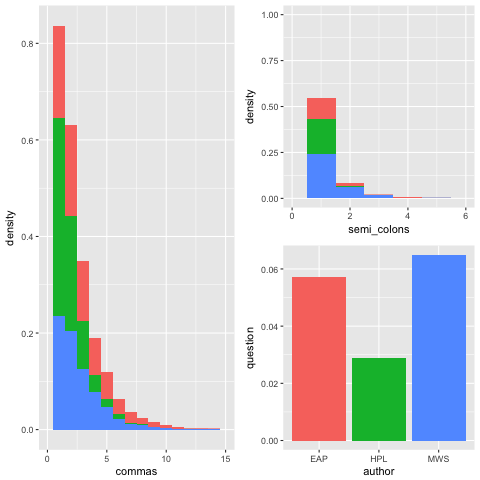
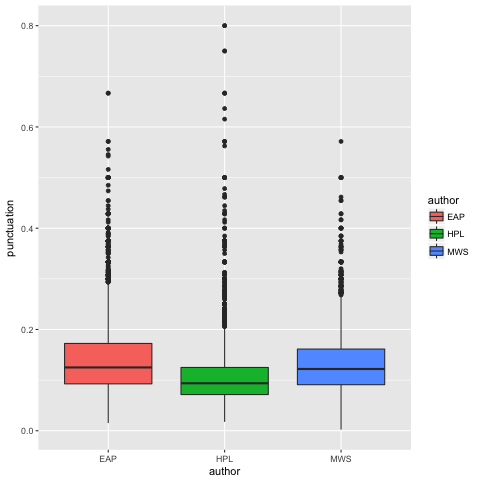
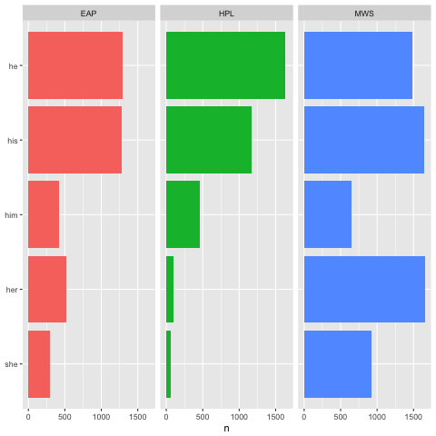
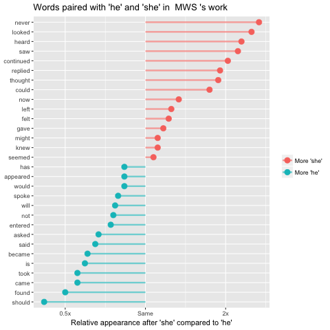
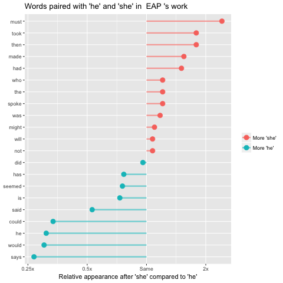
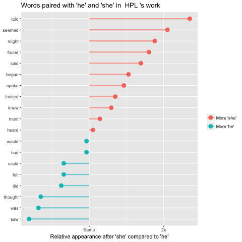
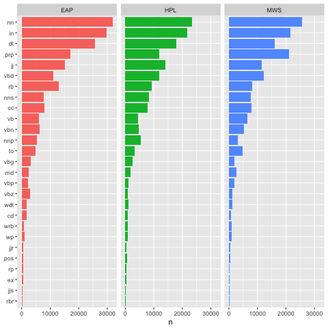

# Spring2018
# Project 1:

----


### [Project Description](doc/)
This is the first and only *individual* (as opposed to *team*) this semester. 

Term: Spring 2018

+ Project title: What do the words and structures used by Edgar Allan Poe, Mary Shelley and Howard Phillips Lovecraft tell us about their styles ?
+ This project is conducted by Jerome Kafrouni - jk4100
+ Project summary: In this project, we learn how the three authors write, using three different approaches that each teach us about their styles. First, we look at their texts quantitatively, ie by counting characters, lengths, etc, and not looking at the words themselves. We measure the impact of these numerical attributes by using a simple Machine Learning model. We then look more closely at these authors' work by looking at what words they tend to use, in various ways. Finally, we look at the functions of these words using Part of Speech tagging. The three authors under scrutiny are known to have quite similar styles and to have influenced each other, but we'll see that, perhaps sometimes unintentionnally, they left some clues and hints in their texts that we'll make sure to leverage to analyze how they write !

Following [suggestions](http://nicercode.github.io/blog/2013-04-05-projects/) by [RICH FITZJOHN](http://nicercode.github.io/about/#Team) (@richfitz). This folder is organized as follows.

## What do the words and structures used by Edgar Allan Poe, Mary Shelley and Howard Phillips Lovecraft tell us about their styles ?

### A numerical perspective

First, we look at numerical features, ie we count (or observe presence/absence of) characters, terms, etc. Three interesting numerical features are how many commas and semi-colons the authors use. One feature that varies a lot is the use of questions: HP Lovecraft uses twice less questions than Mary Shelley and Edgar Allan Poe ! One possible explanation is that HP Lovecraft uses less dialogue (2% of his sentences are dialogues, vs 5% for Mary Shelley and up to 10% for Edgar Allan Poe, see Section 4 of code), and we usually use questions in dialogues.



Another interesting feature is how much do these authors use punctuation in general. We count how many punctuation characters they use per sentence and compare it to the number of words in this sentence. The corresponding ratio gives the following plot:



Again, we can observe a difference between the authors, HP Lovecraft tends to use less punctuation, and he's more constant in the number of punctuation marks that he uses (the variable has a lower variance).


If we use these features to train a Machine Learning model (Random Forest) that classifies sentences, we get 50 % accuracy on a multiclass model, and on average 70 % accuracy on a "one vs all" model, which is not bad at all, because we're not looking at the content itself ie at the words !

### Vocabulary, what do they say ?

In my analysis, I looked at various differences in the vocabulary used by the authors. One interesting observation is that Mary Shelley seems to have a smaller vocabulary, ie she uses less different words on the total corpus than the others.

The most interesting observation is how they represent men and women. If we count how many times they use "he", his", "him" or "she", "her", we can see that HP Lovecraft and Edgar Allan Poe tend to refer way more often to men than to women !



To go deeper in this analysis, we can use bigrams and analyze what are the most likely words after "he" vs after "she" for each author. We do this for each author:





### Vocabulary, how do they write ?

The last component of the analysis is to look at the structure of the sentences. To do this, we use a Part of Speech tagger.
The first thing that I did is to identify sentences that contain an Entity: this completes what I've done in the other sections. When looking at numerical attributes, I counted the number of uppercase letters, which are mostly used for nouns. Then, I used a dictionnary of names when looking at the vocabulary. These techniques were too simple to give significant insights (see notebook). With part of speech tagging, we have significantly better results, and we observe that HP Lovecraft and Mary Shelly tend to use more entities than Edgar Allan Poe (3 % more).

One last analysis is to use our part of speech tagger not only for entities but for any tags. I ran the tagger on full sentences, and then replaces the text by the corresponding tags. This allowed me to re-compute frequencies but this time using POS tags instead of words.



We can see that Edgar Allan Poe uses much more nouns (nn), HP Lovecraft seems to use a lot of adjectives (jj) while Mary Shelley can be characterized by her use of determiners (dt).

To fully understand this last graph, check out the abreviations commonly used in Part of Speech tagging, at: https://www.ling.upenn.edu/courses/Fall_2003/ling001/penn_treebank_pos.html.  

```
proj/
├── lib/
├── data/
├── doc/
├── figs/
└── output/
```

Please see each subfolder for a README file.
